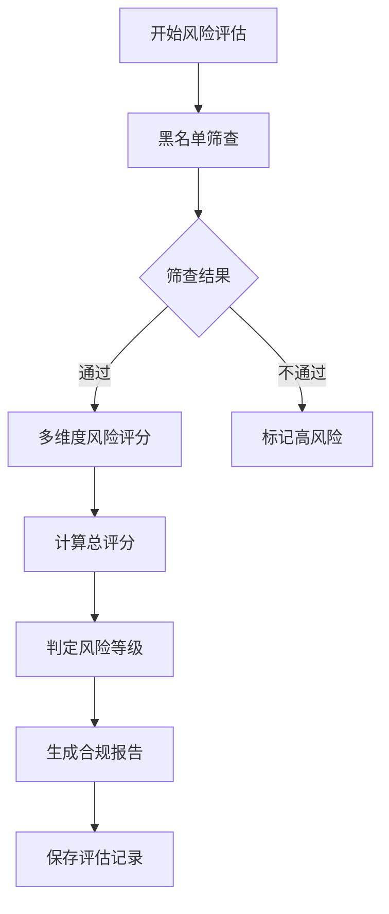

# 客户风险管理系统 PRD

## 1. Product Overview
客户风险管理系统是一个用于金融机构管理客户信息和进行风险评估的综合平台，支持客户资料维护、黑名单筛查、合规检查及多维度风险评级。
- 主要服务于金融合规部门和客户关系管理人员，解决客户身份验证、风险监控和合规报告等核心问题
- 提升金融机构的风险管控能力，确保合规经营，降低洗钱和恐怖融资风险

## 2. Core Features

### 2.1 User Roles
| Role | Registration Method | Core Permissions |
|------|---------------------|------------------|
| 合规管理员 | 内部账号分配 | 客户信息管理、风险评估、合规审查、报告生成 |
| 客户经理 | 内部账号分配 | 客户信息维护、查看风险评级 |
| 系统管理员 | 内部账号分配 | 用户管理、系统配置、数据备份 |

### 2.2 Feature Module
1. **客户信息管理页**：客户基本信息、关联人员管理、附件管理
2. **风险评估页**：多维度风险评分、黑名单检查、合规报告
3. **客户列表页**：客户检索、状态管理、批量操作

### 2.3 Page Details
| Page Name | Module Name | Feature description |
|-----------|-------------|---------------------|
| 客户信息管理页 | 基本信息管理 | 编辑客户中英文名称、ID、地址、国籍、出生日期、联系方式等基础信息 |
| 客户信息管理页 | 关联人员管理 | 添加/编辑股东、董事、持有人、授权人等关联方信息 |
| 客户信息管理页 | 状态管理 | 设置客户状态（有效/无效）、记录创建和修改时间 |
| 风险评估页 | 黑名单筛查 | 对接OFAC、UNSCCL等国际制裁名单进行实时检查 |
| 风险评估页 | 多维度风险评分 | 基于客户身份、财富来源、业务类型、地理区域等10+维度进行风险评分 |
| 风险评估页 | 风险等级判定 | 根据总分自动判定低/中/高风险等级 |
| 风险评估页 | 合规报告 | 生成合规检查报告，记录评估历史 |
| 附件管理 | 文档上传 | 支持上传身份证、护照、商业登记证等合规文档 |

## 3. Core Process

### 客户信息管理流程
1. 合规人员创建新客户档案
2. 录入客户基本信息及关联人员信息
3. 上传相关合规文档
4. 保存并提交风险评估

### 风险评估流程

## 4. User Interface Design

### 4.1 Design Style
- **主色调**：深蓝色（#1E40AF）、白色（#FFFFFF）
- **辅助色**：绿色（#10B981）表示低风险、黄色（#F59E0B）表示中风险、红色（#EF4444）表示高风险
- **按钮风格**：圆角矩形，主按钮使用深蓝色填充
- **字体**：系统默认无衬线字体，标题16-20px，正文14px
- **布局风格**：卡片式布局，左右分栏（左侧表单，右侧风险信息）
- **图标风格**：简约线性图标

### 4.2 Page Design Overview
| Page Name | Module Name | UI Elements |
|-----------|-------------|-------------|
| 客户信息管理页 | 基本信息表单 | 标签页布局，分组显示不同类型信息，输入框带验证提示 |
| 风险评估页 | 风险评分卡片 | 评分矩阵表格，风险等级高亮显示，评估历史时间线 |
| 附件管理 | 文件列表 | 缩略图预览，支持拖拽上传，文件操作按钮 |

### 4.3 Responsiveness
- 桌面端优先设计，支持1920×1080及以上分辨率
- 平板端适配：左右分栏改为上下布局
- 移动端适配：简化表单，折叠非关键模块

### 4.4 交互设计
- 表单实时验证，错误提示清晰
- 风险评分动态计算，实时反馈
- 附件上传支持进度显示
- 黑名单筛查结果带有动画提示
